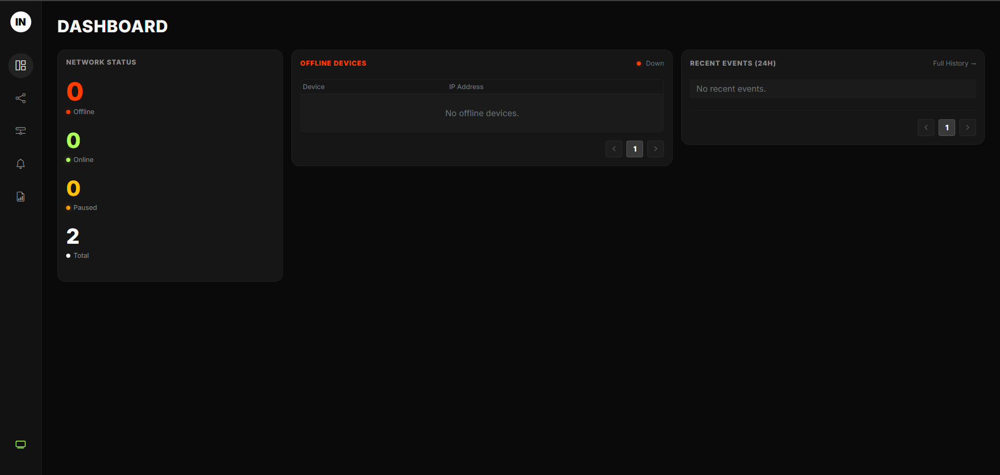
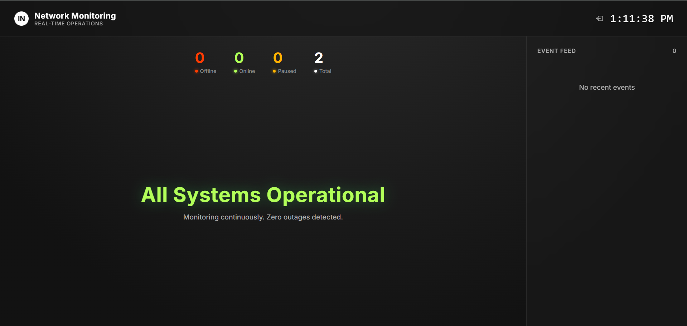
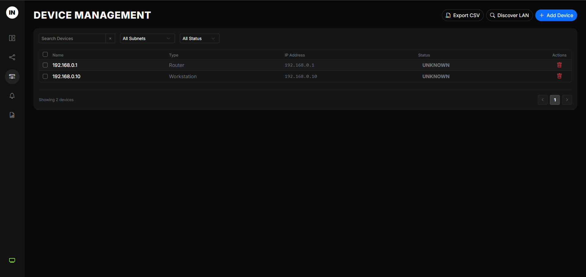
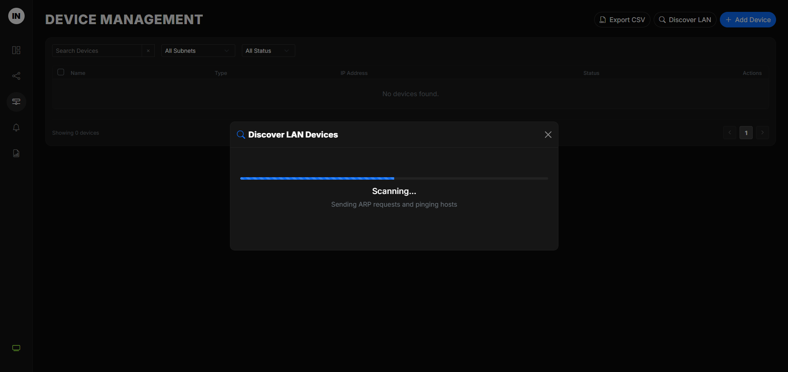
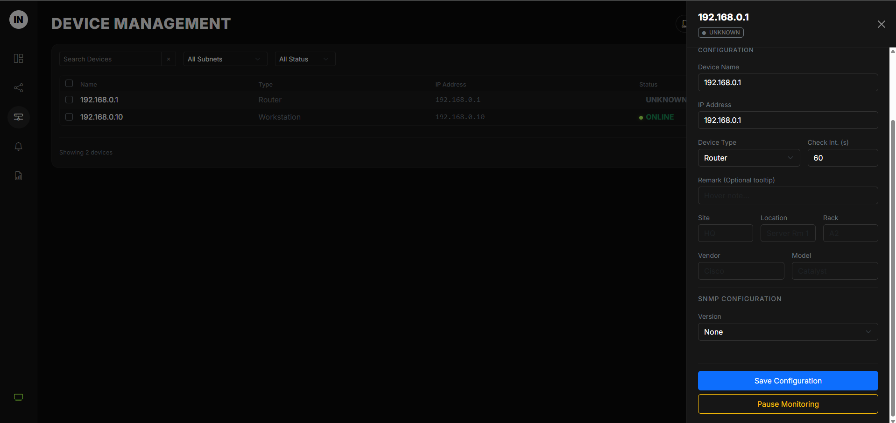
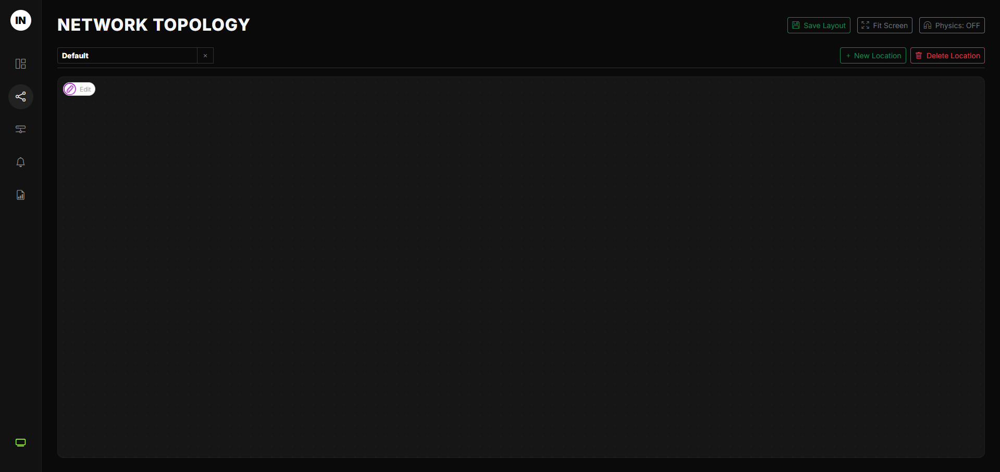
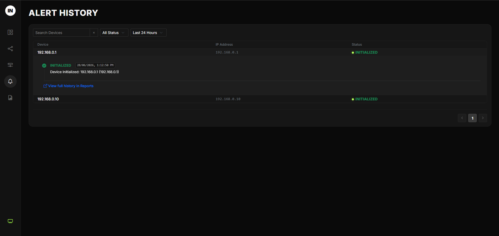
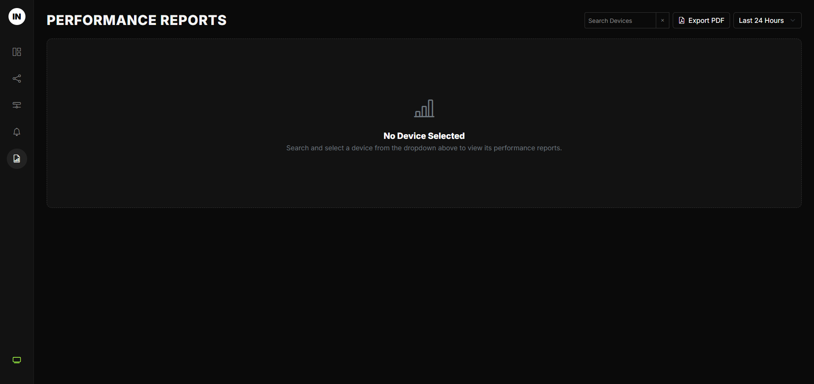

# Network Monitoring System

[](LICENSE)


[](https://github.com/unkthexvii/network-monitor/releases)

Real-time network surveillance tool for Windows. Monitors endpoints via ICMP ping and SNMP telemetry — with a live web dashboard and **full-screen NOC wall display**.

> 🖥️ **Big Screen Ready:** Open `/wall` on any browser for a live NOC wall display — shows offline device count, outage list, and scrolling event feed. Perfect for TV/monitor dashboards in network operations centers.

## Screenshots


*Dashboard — summary stats, recent events, offline device list*


*Wall display — full-screen NOC view with outage counter and event feed*



*Device management and LAN discovery*


*Device detail panel with SNMP info and performance charts*


*Interactive network topology map*


*Alert history with filtering*


*PDF performance report generation*

## Quick Start

### Option 1: Run from Source (Development)

```batch
:: Requires Python 3.10+ and Administrator privileges
python main.py
```

Open [http://localhost:8000](http://localhost:8000)

### Option 2: Download the EXE (no logo included)

[⬇️ **Download Latest Release**](https://github.com/unkthexvii/network-monitor/releases)

```batch
:: Run as Administrator
NetworkMonitor_Win7.exe
```

Open [http://localhost:8000](http://localhost:8000)

> ⚠️ **Administrator privileges are required** for ICMP ping to work on Windows.
> ℹ️ The release EXE does **not** include any logo file — place your own logo in the `logo/` folder next to the executable for branded PDF reports.

---

## First-Time Setup

### 1. Add Devices
1. Open the web UI at `http://localhost:8000`
2. Go to **Device Management** → **Add Device**
3. Enter IP address and device type
4. Save — monitoring starts immediately

### 2. Auto-Discover (Optional)
1. Go to **Device Management** → **Discover LAN**
2. Select a subnet from the dropdown
3. Click **Start Discovery**
4. Check the boxes for found devices and import them

### 3. Configure SNMP (Optional)
When adding/editing a device:
- **Version:** `v2c` or `v3`
- **v2c:** Enter the community string (e.g., `public`)
- **v3:** Enter username, auth password, and privacy password

---

## Pages

| Page | URL | Description |
|------|-----|-------------|
| **Dashboard** | `/dashboard` | Summary stats, recent events, offline devices |
| **Wall Display** | `/wall` | **Full-screen NOC wall** — hero counter, outage list, scrolling event feed, auto-scroll |
| **Devices** | `/devices` | Device management, add/edit/delete, LAN discovery |
| **Alerts** | `/alerts` | Alert history with filtering and search |
| **Topology** | `/topology` | Interactive network topology map |
| **Reports** | `/reports` | Performance reports (PDF export) |

---

## Configuration

All settings are in `core/config.py`. Override via environment variables:

| Variable | Default | Description |
|----------|---------|-------------|
| `MONITOR_PORT` | `8000` | Web server port |
| `MONITOR_PING_COUNT` | `3` | ICMP ping packets per check |
| `MONITOR_PING_TIMEOUT` | `1.0` | Ping timeout in seconds |
| `MONITOR_OFFLINE_THRESHOLD` | `3` | Consecutive failures to declare OFFLINE |
| `MONITOR_ONLINE_THRESHOLD` | `3` | Consecutive successes to declare ONLINE |
| `MONITOR_RETENTION_DAYS` | `7` | Raw ping data retention (days) |
| `MONITOR_STAT_RETENTION_DAYS` | `7` | Minute stats retention (days) |
| `MONITOR_EVENT_RETENTION_DAYS` | `90` | Alert history retention (days) |
| `MONITOR_DATABASE_URL` | `sqlite+aiosqlite:///monitor.db` | Database path |
| `MONITOR_CACHE_TTL` | `60` | Dashboard/report cache TTL (seconds) |

---

## Building from Source

### Modern Windows (10/11)
```batch
build.bat
```
Output: `dist\NetworkMonitor.exe`

### Windows 7
```batch
build_win7.bat
```
Output: `dist\NetworkMonitor_Win7.exe`

Requires `uv` (Python package manager) — install with:
```powershell
powershell -c "irm https://astral.sh/uv/install.ps1 | iex"
```

---

## Database

- **SQLite** with WAL mode for performance
- File: `monitor.db` in the application directory
- Old data is automatically archived to `archives/` folder
- No separate database server required

---

## Project Structure

```
├── main.py              # Application entry point
├── api/                 # REST API routers
├── core/                # Monitoring engines (ICMP, SNMP, scheduler)
├── database/            # SQLAlchemy models and session
├── reporting/           # PDF report generation
├── static/              # Frontend SPA (HTML, JS, CSS)
├── docs/                # Architecture documentation
├── logo/                # Place your logo here (PNG/JPG/SVG)
│   └── .gitkeep
└── dist/                # Packaged executables
```

> **Logo:** Place your company logo in `logo/` (PNG, JPG, or SVG). It will appear in PDF reports and as the favicon. The folder contains a `.gitkeep` to preserve the directory structure — replace it with your own logo file.

---

## Documentation

- [Architecture Overview](docs/overview.md)
- [Backend Details](docs/backend.md)
- [Frontend UI](docs/frontend.md)
